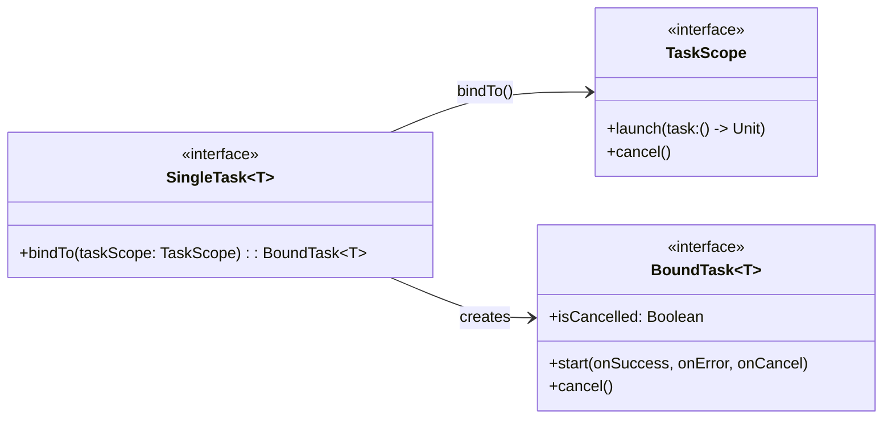
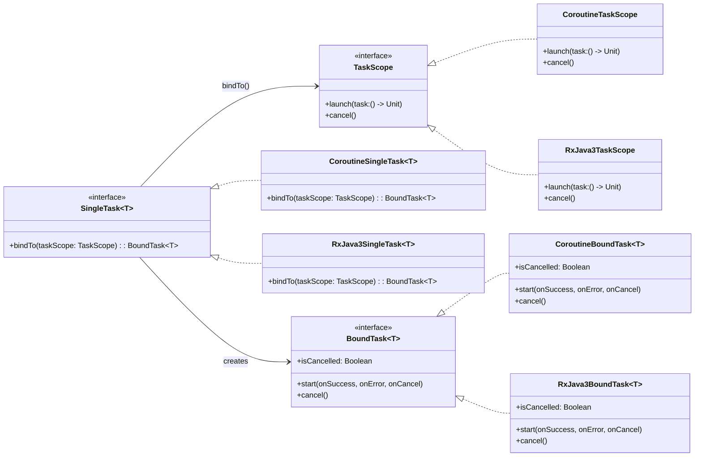

# Binda Core Task System

## interfaces

```mermaid
classDiagram
    direction LR

    class TaskScope {
        <<interface>>
        +launch(task: () -> Unit)
        +cancel()
    }

    class SingleTask~T~ {
        <<interface>>
        +bindTo(taskScope: TaskScope): BoundTask~T~
    }

    class BoundTask~T~ {
        <<interface>>
        +isCancelled: Boolean
        +start(onSuccess, onError, onCancel)
        +cancel()
    }

    SingleTask~T~ --> TaskScope : bindTo()
    SingleTask~T~ --> BoundTask~T~ : creates
```

## implementations

```mermaid
classDiagram
    direction LR

    class TaskScope {
        <<interface>>
        +launch(task: () -> Unit)
        +cancel()
    }

    class CoroutineTaskScope {
        +launch(task: () -> Unit)
        +cancel()
    }

    class RxJava3TaskScope {
        +launch(task: () -> Unit)
        +cancel()
    }

    class SingleTask~T~ {
        <<interface>>
        +bindTo(taskScope: TaskScope): BoundTask~T~
    }

    class CoroutineSingleTask~T~ {
        +bindTo(taskScope: TaskScope): BoundTask~T~
    }

    class RxJava3SingleTask~T~ {
        +bindTo(taskScope: TaskScope): BoundTask~T~
    }

    class BoundTask~T~ {
        <<interface>>
        +isCancelled: Boolean
        +start(onSuccess, onError, onCancel)
        +cancel()
    }

    class CoroutineBoundTask~T~ {
        +isCancelled: Boolean
        +start(onSuccess, onError, onCancel)
        +cancel()
    }

    class RxJava3BoundTask~T~ {
        +isCancelled: Boolean
        +start(onSuccess, onError, onCancel)
        +cancel()
    }

    TaskScope <|.. CoroutineTaskScope
    TaskScope <|.. RxJava3TaskScope
    SingleTask~T~ <|.. CoroutineSingleTask~T~
    SingleTask~T~ <|.. RxJava3SingleTask~T~
    BoundTask~T~ <|.. CoroutineBoundTask~T~
    BoundTask~T~ <|.. RxJava3BoundTask~T~

    SingleTask~T~ --> TaskScope : bindTo()
    SingleTask~T~ --> BoundTask~T~ : creates
```