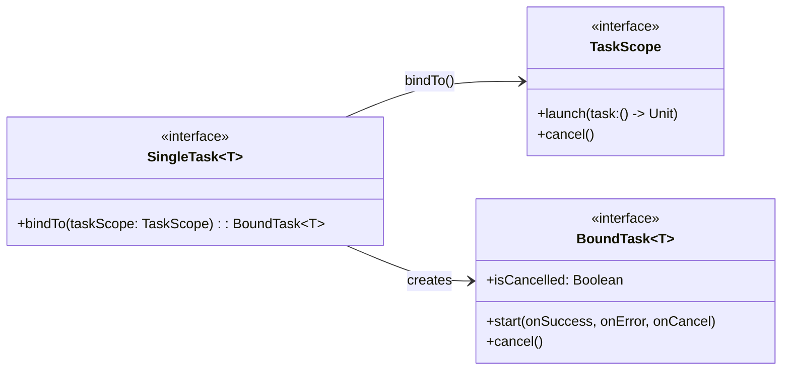
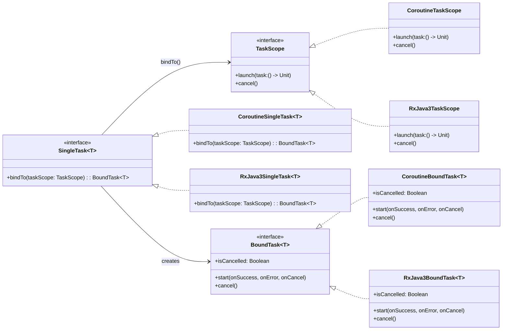

# Binda

`Binda` stands for bind async.
It's useful for people who are tired of migrating async libraries, don't want to migrate anymore.

I don't know why I need to depend on specific async libraries even if I just want to receive a
result of oneshot event.

I don't like to make domain layer dependent on third party libraries.

That's why I made this third party library.

## What's good points?

- Reduce dependencies of async libraries
- Easy to switch async libraries

## How to use

### 1. Set `SingleTask` as a return value

```kotlin
interface FruitRepository {
    fun fetchFruits(): SingleTask<List<String>>
}
```

#### Coroutines sample

```kotlin
class CoroutineFruitRepository : FruitRepository {
    override fun fetchFruits(): SingleTask<List<String>> {
        return CoroutineSingleTask {
            delay(2000)
            listOf("Apple", "Banana", "Orange")
        }
    }
}
```

#### RxJava3 sample

```kotlin
class RxJava3FruitRepository : FruitRepository {
    override fun fetchFruits(): SingleTask<List<String>> {
        return RxJava3SingleTask(
            single = Single
                .timer(3, java.util.concurrent.TimeUnit.SECONDS)
                .map { listOf("Lemon", "Grape", "Kiwi") },
        )
    }
}
```

### 2. Bind scope

Bind `SingleTask` with `TaskScope`.
Then, you can write source code in the same way in different nightmares.
All you have to do is switch `TaskScope`.

#### Coroutines sample

```kotlin
class CoroutineViewModel(
    ioDispatcher: CoroutineDispatcher,
    fruitRepository: FruitRepository,
) : ViewModel() {
    private val taskScope: TaskScope = CoroutineTaskScope(
        scope = viewModelScope,
        dispatcher = ioDispatcher,
    )
    private val _fruits = MutableStateFlow<List<String>>(emptyList())
    val fruits = _fruits.asStateFlow()

    init {
        val task = fruitRepository.fetchFruits()
        val boundTask = task.bindTo(taskScope)
        boundTask.start(
            onSuccess = { result ->
                _fruits.value = result
            },
            onError = { error ->
            },
            onCancel = {
            }
        )
    }
}
```

#### RxJava3 sample

```kotlin
class RxJava3ViewModel(
    ioScheduler: Scheduler,
    fruitRepository: FruitRepository,
) : ViewModel() {

    private val taskScope: TaskScope = RxJava3TaskScope(
        scheduler = ioScheduler,
        disposableContainer = CompositeDisposable(),
    )
    private val _fruits = MutableStateFlow<List<String>>(emptyList())
    val fruits = _fruits.asStateFlow()

    init {
        val task = fruitRepository.fetchFruits()
        val boundTask = task.bindTo(taskScope)
        boundTask.start(
            onSuccess = { result ->
                _fruits.value = result
            },
            onError = { error ->
            },
            onCancel = {
            }
        )
    }

    override fun onCleared() {
        super.onCleared()
        taskScope.cancel()
    }
}
```

## How to extend SingleTask

You can add new one just implementing `SingleTask`, in case a new nightmare appears.

```kotlin
interface SingleTask<T> {
    fun bindTo(taskScope: TaskScope): BoundTask<T>
}
```

### Coroutines sample

```kotlin
class CoroutineSingleTask<T>(
    private val block: suspend () -> T
) : SingleTask<T> {
    override fun bindTo(taskScope: TaskScope): BoundTask<T> {
        return CoroutineBoundTask(
            taskScope = taskScope,
            block = block,
        )
    }
}
```

### RxJava3 sample

```kotlin
class RxJava3SingleTask<T : Any>(
    private val single: Single<T>,
) : SingleTask<T> {
    override fun bindTo(taskScope: TaskScope): BoundTask<T> {
        return RxJava3BoundTask(
            taskScope = taskScope,
            single = single,
        )
    }
}
```

## How to extend TaskScope

You can add new task scope, implementing `TaskScope`.

```kotlin
interface TaskScope {
    fun launch(task: () -> Unit): Cancelable
    fun cancel()
}

interface Cancelable {
    val isCancelled: Boolean
    fun cancel()
}
```

### Coroutines sample

```kotlin
class CoroutineTaskScope(
    private val scope: CoroutineScope,
    private val dispatcher: CoroutineDispatcher = Dispatchers.Default,
) : TaskScope {
    override fun launch(
        task: () -> Unit,
    ): Cancelable {
        val job = scope.launch(dispatcher) {
            runInterruptible {
                task()
            }
        }
        return object : Cancelable {
            override val isCancelled: Boolean
                get() = job.isCancelled

            override fun cancel() {
                job.cancel()
            }
        }
    }

    override fun cancel() {
        scope.cancel()
    }
}
```

### RxJava3 sample

```kotlin
class RxJava3TaskScope(
    private val disposableContainer: CompositeDisposable,
    private val scheduler: Scheduler = Schedulers.io(),
) : TaskScope {
    override fun launch(task: () -> Unit): Cancelable {
        val worker = scheduler.createWorker()
        val disposable = worker.schedule {
            task()
        }
        disposableContainer.add(disposable)
        return object : Cancelable {
            override val isCancelled: Boolean
                get() = disposable.isDisposed

            override fun cancel() {
                disposable.dispose()
            }
        }
    }

    override fun cancel() {
        disposableContainer.clear()
    }
}
```

## Structure of Binda

### interfaces



### implementations

